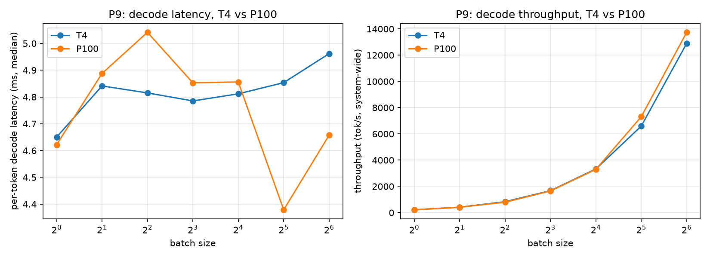

# mini-gpt-inference

[](https://github.com/AbdullahRasheed45/mini-gpt-inference/actions/workflows/ci.yml)
[](LICENSE)

A from-scratch LLM inference engine serving the 50.9M-parameter GPT trained in
[Project A (mini-gpt-ddp)](https://github.com/AbdullahRasheed45/mini-gpt-ddp) --
KV cache, paged attention, continuous batching, CUDA graphs, a hand-written
Triton kernel, INT8 quantization, and speculative decoding, each implemented
from first principles and measured against nine falsifiable predictions
stated *before* being checked (`docs/PLAN.md` §6). Project B of a three-project
ladder targeting ML/research engineer roles at frontier labs: (A) distributed
pretraining, (B) inference engine, (C) GRPO post-training with a vLLM rollout
server.

## Headline results

| | result |
|---|---|
| **Correctness** | paged attention == static cache, byte-exact, including under a forced mid-decode preemption; speculative decoding proven distribution-preserving via a 150,000-sample chi-square test, not just "looks right" |
| **Largest single win** | CUDA graphs, **3.22x** at bs=1 decode on a real T4 (predicted 3-10x) |
| **Memory** | INT8 weight-only quantization: **24.4%** smaller, **+0.03%** perplexity cost (target was <1%) |
| **A negative result, published instead of buried** | naive INT8 dequant-then-matmul is slower than fp16 (confirmed, 2.4-7x depending on hardware); a hand-tuned fused Triton kernel *still* doesn't beat it at this scale -- overhead-bound, not a kernel-quality problem |
| **The hardware study (P9)** | predicted a T4-vs-P100 crossover; **found none** -- both chips sit 14-33x above their own bandwidth floor, so Python/launch overhead swamps the hardware difference entirely at this model size |
| **9/9 predictions checked** | 3 confirmed as stated, 1 confirmed-with-mechanism, 3 refuted in magnitude but explained, 1 split, 1 refuted outright -- see [Predictions vs measurements](#predictions-vs-measurements) |

## Why a 50M-parameter model is an interesting inference target

Small models are *harder* to serve efficiently than large ones, in an
instructive way. At batch size 1 this model needs a 102 MB weight read per
token -- a 0.32 ms floor on a T4 -- while its arithmetic intensity (~1
FLOP/byte) sits ~200x below the T4's roofline ridge point. Decode is not
compute-bound or even really memory-bound in practice; it is bound by
**Python dispatch and kernel launch overhead**, confirmed directly (144
kernel launches for one decode step, 75% of wall-clock spent on dispatch)
and confirmed again by the hardware study below finding no T4-vs-P100
crossover where a real one was predicted. That makes this an unusually clean
setting to measure what CUDA graphs and kernel fusion are actually worth --
and an equally clean setting for optimizations to visibly *not* pay off
until overhead is dealt with first, which is exactly what happened with INT8
and paged attention on CPU. Full derivation of these numbers is in
`docs/PLAN.md` §1.

## Architecture

```
                 ┌─────────────────────────────────────────────┐
  HTTP request → │  FastAPI (server/api.py)                     │
  (OpenAI-shaped)│    /v1/completions, /v1/chat/completions      │
                 └───────────────────┬───────────────────────────┘
                                     │ submit() / stream()
                 ┌───────────────────▼───────────────────────────┐
                 │  AsyncEngine (engine/async_engine.py)          │
                 │    dedicated thread running LLMEngine.step();  │
                 │    per-request queue.Queue bridges to asyncio  │
                 └───────────────────┬───────────────────────────┘
                                     │
                 ┌───────────────────▼───────────────────────────┐
                 │  Scheduler (engine/scheduler.py)               │
                 │    admission, prefill-priority, preempt-by-    │
                 │    recompute when the block pool is exhausted  │
                 └───────────────────┬───────────────────────────┘
                                     │ block tables
                 ┌───────────────────▼───────────────────────────┐
                 │  PagedKVCache (cache/paged.py)                 │
                 │    fixed block pool, gather/indirection        │
                 │    (or StaticKVCache / CUDAGraphRunner for the │
                 │     fixed-shape decode-loop benchmarks)        │
                 └───────────────────┬───────────────────────────┘
                                     │
                 ┌───────────────────▼───────────────────────────┐
                 │  GPT (model.py)                                │
                 │    SDPA attention, or Triton paged-decode      │
                 │    attention on T4; W8A16 int8 linears optional│
                 └───────────────────┬───────────────────────────┘
                                     │ logits
                 ┌───────────────────▼───────────────────────────┐
                 │  Sampling + speculative verification           │
                 │    (sampling.py, engine/spec_decode.py)        │
                 └─────────────────────────────────────────────────┘
```

Full design rationale and the traps found along the way (host syncs breaking
CUDA graph capture, a race between a fast model finishing and an async
consumer subscribing, why `torch.compile` can silently degrade to eager) are
in [`docs/ARCHITECTURE.md`](docs/ARCHITECTURE.md).

## The optimization ladder

Each rung isolates one optimization against its own immediately-prior
baseline -- these are **not** one fully-composed "everything on at once"
serving stack measured end-to-end (see [What's not implemented](#whats-not-implemented-and-why)).
Hardware is labeled per row per `docs/PLAN.md` §10 rule 8; do not compare
across the CPU/T4 boundary as if it were apples-to-apples.

| rung | hardware | metric | result |
|---|---|---|---|
| naive (no cache), 512 tokens | CPU | total latency | 17,777 ms (34.7 ms/tok) |
| **+ KV cache** | CPU | total latency | 5,183 ms (10.1 ms/tok) -- **3.43x** |
| + static batching, bs=32 | CPU | throughput | 1,865 tok/s (knee at bs≈32-64) |
| + paged attention + continuous batching, high-variance workload | CPU | speedup vs static | 1.15x measured (2.27x theoretical compute ceiling; overhead-bound at this scale) |
| **+ CUDA graphs, bs=1 decode** | T4 | latency | 1,397 µs/tok, vs 4,496 µs eager -- **3.22x** |
| + Triton paged decode attention, num_seqs=8 | T4 | latency | 165 µs vs 365 µs gather+SDPA -- **2.22x** |
| + INT8 (naive dequant-then-matmul) | T4 | latency | 77.1 µs vs 32.3 µs fp16 -- **0.42x (slower)**, a confirmed negative result |
| + speculative decoding, self-spec γ=1 | CPU | acceptance / speedup | α=0.398, mean accepted length 1.39, wall-clock **0.46x (slower)** -- draft pass is deliberately uncached |

Every number above traces to a committed JSON under `bench/results/`; see
[`docs/BENCHMARKS.md`](docs/BENCHMARKS.md) for the full methodology, every
table, and the reasoning behind each result.

## The hardware study: T4 vs P100 (P9)

**Predicted**: P100 wins bs=1 decode (2.3x the T4's memory bandwidth, and
nothing to lose from lacking fp16 tensor cores when there's no batched matmul
to accelerate); T4 wins large-batch decode (fp16 tensor cores; P100 -- Pascal,
sm60 -- has none). **Measured**: no crossover at any batch size 1-64 -- both
land in the same ~4.4-5.0ms/token band, within ~5% of each other throughout.



Quantified, not shrugged at: each chip's own bandwidth-bound floor (weight
bytes / bandwidth) is 0.320ms (T4) and 0.140ms (P100) -- P100 *should* be
2.3x faster. Measured bs=1 latency is 14.5x and 33x slower than each chip's
own floor, respectively: real overhead of ~4.5ms per step swamps a real but
tiny 0.18ms bandwidth advantage completely. This is the same kernel-launch-
overhead-bound regime Phase 4 measured directly (144 kernel launches for one
decode step, 75% of wall-clock spent on dispatch, not math) -- at this
model's scale, neither chip's actual silicon characteristics are the
bottleneck. (Project A's *training* throughput comparison on the same two
chips, by contrast, showed T4 winning a real 2.1x from tensor cores -- a
compute-bound, many-large-matmuls workload that actually reaches the regime
this decode benchmark never does.) Getting the P100 side running at all also
surfaced that Kaggle's current base-image torch has dropped sm60 support
entirely, not just Triton as `docs/PLAN.md` predicted -- see
`docs/BENCHMARKS.md`'s Phase 8 section for the fix.

## Predictions vs measurements

Stated before measuring (`docs/PLAN.md` §6); "being wrong in public with an
explanation is worth more than a table of unexamined numbers."

| # | prediction | result |
|---|---|---|
| P1 | KV cache: 10-40x speedup at 512 tokens | **Directionally confirmed, magnitude short**: 3.43x on CPU. A T4 re-run didn't happen (Lightning credit ran out before it could be scheduled) -- P2/P3 below answer the same underlying question directly on the target hardware instead. |
| P2 | bs=1 decode: >90% of wall-clock is overhead, not math | **Directionally confirmed**: 74.7% on T4 (144 kernel launches/step). Short of >90%, likely because this model is smaller than whatever workload the figure was calibrated against. |
| P3 | CUDA graphs: 3-10x at bs=1 | **Confirmed**: 3.22x on T4, at the lower edge of the predicted range -- the largest single win measured in this project. |
| P4 | Throughput scales ~linearly to bs≈64-128, then bends | **Confirmed (CPU)**: knee at bs≈32-64, earlier than predicted (fewer parallel lanes than a T4). T4 re-run of the exact knee didn't happen (same credit exhaustion). |
| P5 | Continuous batching: 2-4x on high-variance workloads | **Refuted in wall-clock (1.15x measured) but the mechanism is validated**: the theoretical compute ceiling is 2.27x, squarely in the predicted range -- the engine's own Python bookkeeping costs more than this tiny model saves on CPU. |
| P6 | Paged attention: costs "a few %" vs static caching | **Refuted**: 81% slower, measured on CPU. Correctness (not performance) was this phase's real gate, and it's byte-exact including under a forced preemption. |
| P7 | Naive INT8 dequant is slower than fp16; a fused kernel wins | **Split, reported as such**: naive-is-slower confirmed strongly (7x CPU, 2.4x T4). Fused-kernel-wins refuted even after a real on-hardware block-size sweep -- launch-overhead-bound, the same story as P2/P9. |
| P8 | Prompt-lookup acceptance α≈0.3-0.6 on TinyStories | **Confirmed at γ=1** (α=0.300, the bottom edge of the band). Falls sharply as γ grows since a repeated run's real length is fixed, not something proposing more tokens can extend. |
| P9 | P100 wins bs=1 decode; T4 wins large-batch decode | **Refuted outright, with a verified mechanism**: no crossover at any batch size -- both chips are 14-33x above their own bandwidth floor, so overhead dominates before either chip's real hardware characteristics can matter. |

## What's not implemented, and why

- **Tensor/pipeline parallelism** -- a 102 MB model on a 16 GB card needs neither.
- **FlashAttention-2 / FP8** -- both need Ampere+/Hopper; unavailable on T4/P100.
- **Multi-node serving** -- out of scope for a single-GPU-class model.
- **Prefix caching / RadixAttention** -- high value for shared system prompts;
  this project's workload has none. Noted as future work.
- **Chunked prefill** -- worth it for long prompts; this model caps at 512 tokens.
- **Instruction tuning / chat quality** -- that's Project C.
  `/v1/chat/completions` exists for OpenAI API *shape* compatibility only; it
  applies a trivial, un-trained-for template to a base model that was never
  instruction-tuned, and says so in both the code and here.
- **A cached self-speculative draft pass** -- `SelfSpeculativeDrafter`
  deliberately re-forwards the growing context from scratch each round
  (unambiguous correctness over draft-side speed, documented in its own
  module docstring); a `StaticKVCache`-backed draft path is the natural fix,
  left as follow-up.
- **T4 re-measurement of P1/P4/P5/P6's exact magnitudes** -- Lightning AI's
  free-tier credit ran out mid-Phase-8, before these specific re-runs
  (mentioned as planned in earlier `docs/BENCHMARKS.md` sections) could be
  scheduled. The CPU numbers stand as the reported result; P2/P3/P9 (which
  did get real T4/P100 time) answer the closely-related overhead-vs-hardware
  question directly.
- **One fully-composed, everything-on pipeline benchmark** -- each rung in
  the optimization ladder above measures its own optimization in isolation
  against its immediately-prior baseline, matching the plan's own
  phase-by-phase, gate-per-phase structure. No single benchmark run stacks
  every optimization into one serving configuration and measures the
  composed result end-to-end.

## Reproduction

```bash
git clone https://github.com/AbdullahRasheed45/mini-gpt-inference.git
cd mini-gpt-inference
python -m venv .venv && source .venv/bin/activate
pip install -e ".[server,bench,dev]"   # add "gpu" too on a CUDA machine with Triton

pytest                                  # correctness ladder, CPU, CI-equivalent (98 passed, 7 GPU-only skipped)
ruff check .                            # lint

python scripts/run_all_benchmarks.py --fast   # quick local sanity pass, every bench script
python scripts/run_all_benchmarks.py          # full §10 spec: 30 repeats, slow; needs HF_TOKEN + GPU
                                               # for the checkpoint-dependent sections (quant perplexity,
                                               # spec-decode, hardware study) to run rather than skip

HF_TOKEN=... python scripts/serve.py          # launch the OpenAI-compatible server on the real checkpoint
curl localhost:8000/v1/completions -d '{"model": "minigpt-infer", "prompt": "Once upon a time", "max_tokens": 32}'
```

## Layout

```
docs/PLAN.md          # authoritative implementation plan and predictions (§6)
docs/CHECKLIST.md     # ordered task list with per-phase gates
docs/ARCHITECTURE.md  # design rationale and the traps found implementing it
docs/BENCHMARKS.md    # every number, every table, full methodology
src/minigpt_infer/    # the engine: model, cache/, engine/, quant/, server/
bench/                # benchmark harness; every published number regenerates from here
scripts/              # download_checkpoint.py, serve.py, run_all_benchmarks.py
tests/                # correctness ladder (docs/PLAN.md §8), CPU, CI-gated
kaggle_project/       # script-kernel pushed to Kaggle for the P100 hardware-study run
```
