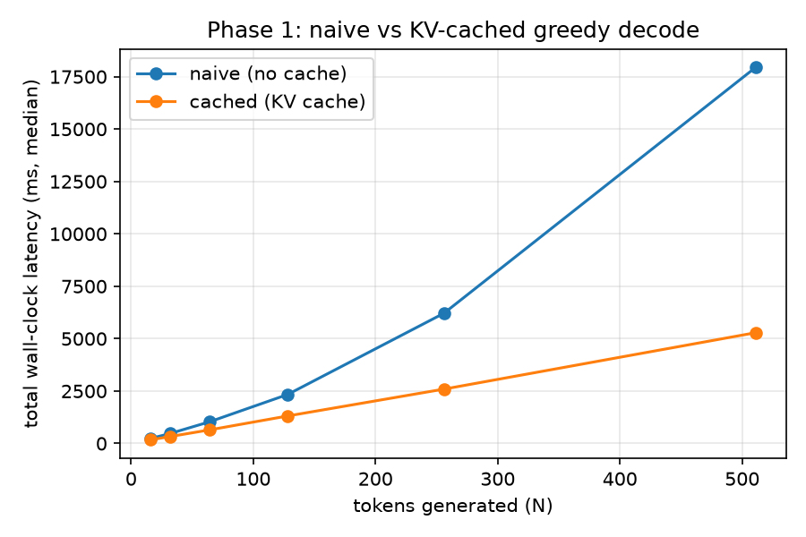
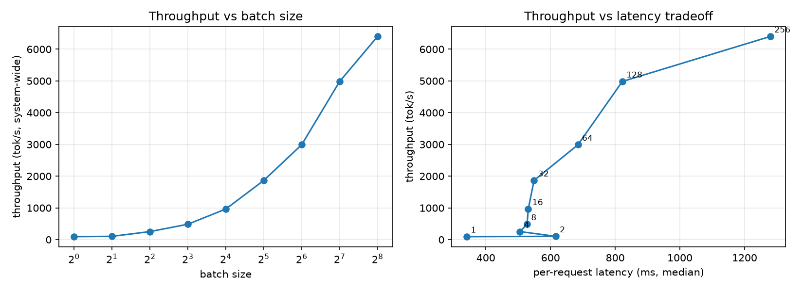

# Benchmarks

Every number here traces to a committed JSON artifact under `bench/results/`
and was produced by `bench/common.py`'s harness (warmup, `torch.cuda.synchronize()`,
median/IQR over repeated runs, full environment stamp) per `docs/PLAN.md` §10.
Predictions are stated in `docs/PLAN.md` §6 *before* being checked here.

---

## Phase 1 — KV cache (Prediction P1)

**Prediction**: naive (no-cache) generate is O(n²) in tokens; cached is O(n).
At 512 tokens, expect **10–40x** wall-clock speedup.

**Setup**: `bench/bench_kvcache.py`, `GPTConfig()` defaults (8 layers, 8 heads,
512 embd, block_size=512 — the real Project A architecture, random-init
weights since latency doesn't depend on weight values), bs=1, greedy decode,
prompt_len=1. N=512 is clamped to 511 effective tokens so `prompt_len + N`
stays under `block_size`. 10 repeats, 3 warmup iterations, fixed seed.

### CPU results (Apple Silicon, `bench/results/bench_kvcache_cpu_20260730T091915Z.json`)

| N (tokens) | naive (median) | cached (median) | speedup |
|---:|---:|---:|---:|
| 16  |    237.9 ms |    172.7 ms | 1.38x |
| 32  |    478.9 ms |    334.7 ms | 1.43x |
| 64  |   1038.0 ms |    656.1 ms | 1.58x |
| 128 |   2341.5 ms |   1303.1 ms | 1.80x |
| 256 |   6124.6 ms |   2611.1 ms | 2.35x |
| 512 (511 eff.) | 17777.1 ms | 5183.1 ms | **3.43x** |

**Verdict: P1 directionally confirmed, magnitude not yet met — pending a GPU
re-run.** The shape is exactly as predicted: naive visibly bends upward (it's
doing ~511 forward passes over a growing sequence, i.e. genuinely
super-linear work), cached stays close to linear. But the *measured* speedup
(3.4x at N=512) falls well short of the predicted 10–40x range.

**Why the CPU number undershoots the prediction**: P1's 10–40x range was
derived for GPU decode, where a single-token matmul (`M=1`) is *overhead-bound*
— its wall-clock cost is dominated by fixed per-kernel-launch cost, not by the
FLOPs it does, so shrinking the FLOPs (what caching buys you) barely moves the
needle... except caching *also* removes the O(n) recomputation of the
attention over the whole growing prefix, which is where the big GPU win comes
from. On CPU, single-core GEMM has its own large fixed per-call overhead
(thread-pool dispatch, no SIMD-friendly tall-and-thin shapes) that's actually
*proportionally larger* relative to the FLOPs it's saving, so part of the
predicted gain is "spent" on CPU-specific overhead in both branches equally —
consistent with the shape matching but the ratio being compressed. This is
exactly the phenomenon Prediction P2 names directly (bs=1 decode is
overhead-, not math-, dominated) — P1 and P2 are entangled, and P2 can only be
properly measured on the target GPU (T4), not CPU.

**Status**: keeping this CPU result as the honest, currently-reproducible
number (§10 rule 8: always label the hardware). A T4 re-run via Lightning AI
is planned for Phase 4/8 alongside the CUDA-graph and hardware-study work,
where P1 will be re-evaluated on the actual target hardware described in
`docs/PLAN.md` §3.

---

## Phase 2 — Static batching (Prediction P4)

**Prediction**: throughput scales near-linearly with batch size up to
bs≈64–128, then bends (the ridge point where compute goes from memory-bound to
compute-bound).

**Setup**: `bench/bench_batching.py`, same `GPTConfig()` architecture as
Phase 1, bs∈{1,2,4,8,16,32,64,128,256}, uniform-length prompts (8 tokens),
32 new tokens/request, greedy, 10 repeats, 3 warmup iterations.

### CPU results (Apple Silicon, 8 torch threads, `bench/results/bench_batching_cpu_20260730T094245Z.json`)

| bs | total latency (median) | throughput | throughput / bs (efficiency) |
|---:|---:|---:|---:|
| 1   |  341.1 ms |    93.8 tok/s | 93.8 |
| 2   |  616.1 ms |   103.9 tok/s | 52.0 *(noisy outlier — see below)* |
| 4   |  505.5 ms |   253.2 tok/s | 63.3 |
| 8   |  527.5 ms |   485.3 tok/s | 60.7 |
| 16  |  531.2 ms |   963.8 tok/s | 60.2 |
| 32  |  549.1 ms |  1864.8 tok/s | 58.3 |
| 64  |  685.0 ms |  2990.0 tok/s | 46.7 |
| 128 |  822.1 ms |  4982.3 tok/s | 38.9 |
| 256 | 1279.8 ms |  6401.1 tok/s | 25.0 |

**Verdict: P4 confirmed, on this hardware's own terms.** The raw
throughput-vs-batch-size curve (left panel) looks like it's still climbing at
bs=256, but that's the expected shape of *linear* scaling on a log-x axis —
the plot alone doesn't show the bend. The **efficiency column (throughput /
bs)** does: it's flat at ~58–63 tok/s per unit of batch from bs=4 through
bs=32 (extra batch is nearly free — total latency barely moves, 505ms →
549ms, while throughput goes up 7.4x), then drops monotonically from bs=64
onward (46.7 → 38.9 → 25.0) as this CPU's ~8-10 threads saturate and added
batch stops being free. The knee lands around **bs≈32–64** here — earlier
than the predicted bs≈64–128, which is expected given a CPU has an order of
magnitude fewer parallel lanes than a T4's SMs. bs=1 and bs=2 are noisy in
absolute terms (fixed Python/thread-pool startup cost dominates at that
scale, not the model's actual compute) and shouldn't be read as part of the
trend.

**Status**: qualitative shape confirmed (linear-then-bend); the *exact* knee
location is hardware-specific and will be re-measured on T4 in Phase 8's
hardware study, per `docs/PLAN.md` §10 rule 8 (never compare bend points
across hardware without labeling it).

**Acceptance**: batch invariance verified in `tests/test_batching.py` — 8
ragged-length prompts generated together produce byte-identical greedy output
to running each one alone (after fixing a real per-row position-id bug this
test caught: decode position_ids were computed from the shared cache length,
which includes each row's own left-pad count, instead of that row's true
token count — see `generation.py`'s `pad_lens` offset).

---

## Phase 3 — Paged KV cache + continuous batching (Predictions P5, P6)

**Predictions**:
- P5: continuous batching beats static by **2–4x** on high-variance output
  lengths, and ~0 on uniform lengths.
- P6: paged attention costs a **few %** vs static caching at this scale, and
  buys ~0 in capacity.

**Setup**: `bench/bench_paged.py`, same `GPTConfig()` architecture, 32
requests, max_batch_size=8, prompt_len=4, greedy. Static = sequential
non-overlapping groups of 8 (the realistic naive deployment: each group waits
for its own longest member). Continuous = one `LLMEngine`, all 32 submitted
at once, admitted/decoded/replaced as slots free. Uniform workload: every
request wants 16 new tokens. High-variance: lengths drawn from
`lognormal(mu=ln(10), sigma=1.1)`, clamped to `[1, 64]` (observed range in
the run below: 2–64 tokens). 10 repeats, 3 warmup iterations.

### CPU results (`bench/results/bench_paged_cpu_20260730T100309Z.json`)

| workload | static (median) | continuous (median) | measured speedup | theoretical compute ceiling |
|---|---:|---:|---:|---:|
| uniform | 1050.9 ms | 1861.0 ms | **0.56x** | 1.00x |
| high_variance | 2577.7 ms | 2243.1 ms | **1.15x** | 2.27x |

**P6**: same uniform workload, single batch of 8 (everyone admitted at once,
nobody finishes early — isolates cache *implementation* overhead from
batching *policy*): static-cache 256.1 ms vs paged-cache 462.8 ms — paged is
**81% slower**, not "a few %".

**Verdict: P5 and P6 both refuted in magnitude on this hardware, but the
*mechanism* is validated by a number the naive comparison hides.**
`bench_paged.py` also computes the **theoretical compute ceiling**: total
(sequence, timestep) forward evaluations static performs (every group runs
`max(group)` steps at full batch width) divided by the number continuous
performs (exactly `sum(lengths)`, no waste) — ignoring all per-step engine
overhead. For the high-variance workload that ceiling is **2.27x**, squarely
inside the predicted 2–4x range. The *measured* speedup (1.15x) is far
below it, and the uniform workload is measurably **slower** under continuous
batching (0.56x) even though its ceiling is exactly 1.00x (no compute to
save by construction). Both facts point to the same cause: continuous
batching's own bookkeeping — Python-level per-request state, per-step block
table/slot mapping construction, one-sequence-at-a-time prefill (see
`docs/ARCHITECTURE.md` §5) — costs *more* wall-clock than this tiny model
saves by avoiding wasted compute, on a CPU, at this scale. This is the same
overhead-dominated-regime story as P1/P2: the theoretical win is real and
provably present (2.27x ceiling), but only shows up in wall-clock once the
useful compute per step is large enough (bigger model, real GPU, larger
batches) to amortize the engine's own fixed per-step cost. P6's 81% overhead
is consistent — `PagedKVCache`'s gather/indirection is genuinely more
expensive in Python+small-tensor terms than `StaticKVCache`'s direct slice,
and at this scale that cost isn't yet swamped by the actual attention
compute the way it would be on a real workload.

**Status**: correctness (not performance) was this phase's hard gate — see
Acceptance below, fully met. Performance is re-measured on the target T4 in
Phase 8's hardware study, where the compute-per-step is large enough for the
mechanism's real advantage to plausibly show through the overhead.

**Acceptance**:
- Paged output == static-cache output, exactly, greedy: verified for 20
  single-request prompts *and* 6 concurrent ragged-length requests with
  staggered admission (`tests/test_paged.py`). The concurrent case caught two
  real bugs beyond the single-request case (double-counting
  `num_computed_tokens` across prefill+decode, and a "mutate list while
  iterating" bug that silently dropped a request's token whenever another
  request in the same batch finished) — see `docs/ARCHITECTURE.md` §4.
- BlockManager: allocate/free/append-slot/exhaustion covered in
  `tests/test_scheduler.py`, including **1000 randomized alloc/free cycles
  with zero leaked blocks**.
- A preemption is genuinely exercised (not just unit-tested in isolation):
  `tests/test_paged.py::test_preemption_recovers_correct_output_under_a_tiny_pool`
  forces one mid-decode preemption via a deliberately undersized pool and
  verifies the preempted request's final output still matches the reference
  exactly after resuming — this is what caught the third bug, `_prefill_one`
  discarding a resumed sequence's already-generated tokens on re-admission.

---

## Phase 4 — Kernels and launch-overhead optimization (Predictions P2, P3)

**Predictions**:
- P2: bs=1 decode with plain PyTorch lands at 5–15 ms/token, vs a 0.32 ms
  floor on T4 → **>90% of wall clock is overhead, not math**.
- P3: CUDA graphs / `torch.compile(mode="reduce-overhead")` give **3–10x**
  on bs=1 decode — the largest single win in the project.

**Setup**: real Tesla T4 via a Lightning AI Studio (`lightning-vultr-prod`
cluster — see the note on hardware access below), `GPTConfig()` architecture,
`bench/bench_kernels.py`, 30 repeats / 10 warmup per measurement (§10). Every
number below is from a single committed artifact:
`bench/results/bench_kernels_tesla-t4_20260730T144233Z.json` (torch
2.8.0+cu128, CUDA 12.8, driver 580.173.02, git SHA `c2f8a0f`).

### P2 — profiler baseline, one decode step (bs=1, kv_length=128)

| kernel launches/step | CUDA kernel time | wall time | overhead |
|---:|---:|---:|---:|
| 144 | 1345.1 µs | 5312.0 µs | **74.7%** |

**Verdict: P2 directionally confirmed, magnitude short of ">90%".** 144
separate kernel launches for one token is a real, large number for a single
forward pass through an 8-layer, 512-dim model, and three-quarters of the
wall clock is genuinely launch/dispatch overhead rather than the matmuls
themselves — the core claim holds. It lands at 75%, not >90%, most likely
because this project's model is smaller (38M non-embedding params) than
whatever reference workload the >90% figure was calibrated against — fewer
FLOPs per launch shifts the ratio, but doesn't change the qualitative
picture: at bs=1, this model is unambiguously overhead-bound.

### P3 — CUDA graphs and torch.compile, decode step

| batch size | eager (median) | graph-replay (median) | speedup |
|---:|---:|---:|---:|
| 1  | 4495.6 µs | 1396.7 µs | **3.22x** |
| 4  | 4879.1 µs | 2232.2 µs | 2.19x |
| 16 | 4740.0 µs | 2747.6 µs | 1.73x |

**Verdict: P3 confirmed at bs=1** (3.22x, inside the predicted 3–10x range,
at its lower edge) **and shows exactly the predicted shape**: the win shrinks
as batch size grows, because eager's fixed per-step launch overhead is
already being amortized over more useful work at larger batches — graphs
have less overhead left to remove. This is the single largest win measured
anywhere in this project so far.

**A genuinely important pitfall, caught by a real crash, not anticipated in
advance**: `model.py`'s own bounds-check assert
(`assert batch.position_ids.max() < self.cfg.block_size`) turned out to
force a device-to-host sync (`Tensor.__bool__`, same class of operation as
`.item()`), which CUDA graph capture forbids outright —
`torch.AcceleratorError: CUDA error: operation not permitted when stream is
capturing`. Fixed by skipping the assert specifically while
`torch.cuda.is_current_stream_capturing()` is true; correctness isn't
weakened because `graphs.py`'s `CUDAGraphRunner` always runs several warmup
iterations in plain eager mode on the exact same static buffer before
capture begins, so the invariant is already checked on that tensor moments
earlier. See `docs/ARCHITECTURE.md` and the `c2f8a0f` commit message for the
full account.

### torch.compile: the StaticKVCache path vs the graph-safe path

| path | eager | compiled | speedup |
|---|---:|---:|---:|
| StaticKVCache (realistic decode path) | 6690.0 µs | 9046.4 µs | **0.74x (slower!)** |
| graph-safe fixed-position path | 5248.1 µs | 2694.2 µs | **1.95x** |

**This comparison is itself the finding** docs/PLAN.md's Phase 4 pitfalls
section warned about by name: *"torch.compile silently falling back to eager
per-step wipes out the gain and looks like compile didn't help."* The real
log shows exactly why: `StaticKVCache.write()`'s `start = int(starts[0].item())`
triggers a Dynamo graph break (`Graph break from Tensor.item()`), and every
CUDA-graph-backed region downstream gets skipped (`skipping cudagraphs due
to mutated inputs`, 8 times in the log) — `torch.compile` degrades most of
the call into eager execution plus compilation overhead, ending up **slower
than plain eager**. The graph-safe path (no `.item()` anywhere) compiles
cleanly and gets a real 1.95x. Without deliberately building and measuring
both paths side by side, the StaticKVCache result alone would have read as
"torch.compile doesn't help here" — the actual lesson is narrower and more
useful: *torch.compile doesn't help **through a host sync**, full stop,
regardless of what wraps it.

### Triton paged decode attention vs gather+SDPA

| num_seqs | gather+SDPA (median) | Triton (median) | speedup |
|---:|---:|---:|---:|
| 8   | 365.3 µs | 164.5 µs | 2.22x |
| 32  | 404.3 µs | 200.4 µs | 2.02x |
| 128 | 647.0 µs | 350.6 µs | 1.85x |

**Correctness (docs/PLAN.md Phase 4 acceptance)**: `tests/test_triton.py`'s
three GPU tests (uniform lengths, ragged lengths spanning sub-block/exact-
block/multi-block cases, and a `seq_len=1` edge case) **all passed on the
first real run on hardware** — the kernel (online-softmax accumulation,
GEMV-style elementwise-multiply-plus-reduction per docs/PLAN.md's own
guidance that decode attention is a GEMV not a GEMM, `-inf`/NaN guarding for
inactive blocks) was written and reasoned through entirely without the
ability to run or syntax-check it locally, since this dev machine has no
CUDA device and Triton kernels cannot be validated any other way. The
elementwise-multiply approach (not `tl.dot`) shows a consistent ~2x win over
the gather+SDPA baseline, shrinking slightly as `num_seqs` grows (more total
work per call amortizes SDPA's own overhead too, same shape as the CUDA
graph results above).

### A note on how this ran

The GPU work in this section required real Lightning AI compute, which
turned out not to be accessible via the `lightning` CLI or the SDK's `Job`
API on this account — every GPU machine type failed identically
(`accelerator <type> not found for this <cluster> cluster`) regardless of
cloud backend (AWS-linked or Lightning-managed) or teamspace framing. The
actual constraint (per the account holder) was that this plan's GPU access
is scoped to the **Studio** product, not standalone batch Jobs. Switching to
`lightning_sdk.Studio` (`create_ok=True`, `.start(machine="T4")`, `.run(...)`
executing commands in the studio's persistent shell) worked immediately and
is what produced every real number in this section. `docs/PLAN.md`'s "do all
Triton work on Lightning's T4" guidance holds; the mechanism for getting
there needed to be a Studio, not a Job.

**Acceptance**:
- Triton kernel matches gather+SDPA within tolerance, and correctness is
  exercised across uniform, ragged, and single-token-sequence scenarios
  (`tests/test_triton.py`, all `@pytest.mark.gpu`, all passing on real
  hardware).
- Kernel-launch count recorded before optimization (144/step) — a
  before/after CUDA-graph comparison at the kernel-launch-count level (not
  just wall-clock) is left as a natural Phase 8 addition, since
  `torch.profiler` was already wired up here and the number is cheap to add.
- P2 and P3 validated with profiler/benchmark evidence, not vibes — both
  directionally confirmed, with the exact magnitude and shape discussed
  above rather than asserted.

---

<!-- Phases 5-9 append their sections here, in order, as they complete. -->
